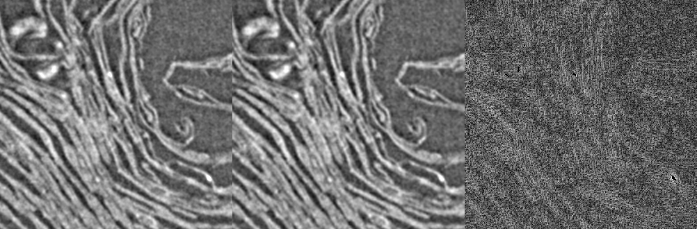

# A Compressing Vesuvius data "Proxy"

This tools allows downloading volumes with (very light) lossy compression.  
Data size comparison for *Scroll1/PHercParis4.volpkg* volume *20230205180739*

- original: **1.7TB**
- compressed: **63GB** (1:27)
- every second slice: **32GB** (1:53)

## Usage

Check the first lines of compressed_dl.sh script to set source data, host and target dir.  
On the remote host you need working opencv-python, jpegxl (cjxl) and wget.

The download script allows to only process and download every n-th slice, for example:
```
compressed_dl.sh 0 14275 2
```
Will download every second slice. You can stop the script and continue at a later time and it will continue where it left off.

## Remote Host

The scrip requires up to 700MB of RAM, but only a small amount of temporary disk space (allocated in /tmp/lavastream.\*).
You can run multiple instances in parallel (e.g. *compressed_dl.sh 0 14275 2* and *compressed_dl.sh 1 14275 2*) will run two instances in parallel to accelerate the processing.
By default only one instance of the jpeg-xl encoder and the python scaler code is run in parallel to save on RAM. Modify the flock code in the script to change this behaviour.

## Compression

Compression is achieved by employing:

- masked volumes
- bicubic resizing
- conversion to 8 bit
- lossless compression with jpex-xl

The original data appears to me to be significantly oversampled and the above compression steps result in visually very minor differences.

To recover tif files comparable to the original (16bit, same image size) run:

```
djxl compressed.jxl half.pgm
python upscale.py -i half.pgm -o uncompressed.tif
```
If we compare the original full size image with this recovered version the difference are minimal:



Left: Original, middle: compressed, right: difference at +8EV.

I believe this quality is sufficient for manual and assisted segmentations and probably also for many other tasks, but we will see.
